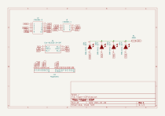
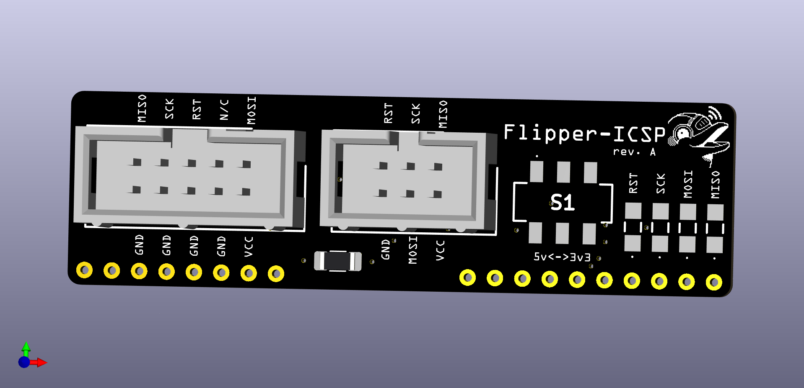
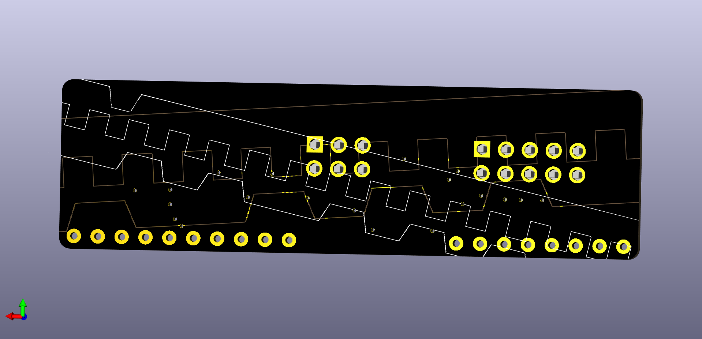

# Flipper-ICSP

Shout out to [Speexvocon](https://github.com/Speexvocon) for his [FlipperZeroKiCadPart](https://github.com/Speexvocon/FlipperZeroKiCadPart) making this project a whole lot easier!

I wanted to make a module for the Flipper Zero that works with [AVR Flasher](https://lab.flipper.net/apps/avr_isp) and simplifies hooking up a AVR microcontroller for flashing.  
This module simply formats the pins used by AVR Flasher into standard 10 position and 6 position ICSP headers with the option to choose between 3v3, 5v, or no supplied voltage.  

